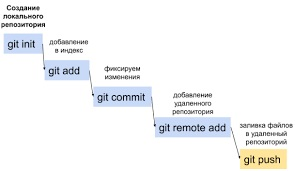

# Инструкция по работе с GIT

Git - это программа для контроля версий.

## Команды Git

Прежде чем создавать репозиторий и инициализировать Git, проверим текущую установленную версию пограммы. Для этого в терминале введём команду **git --version**.
Если Git установлен на компьютер, вы увидите его текущую версию.

### Создание Git-репозитория:
* Берём локальный каталог, который не находится под версионным контролем, и превращаем его в репозиторий
* Клонируем существующий репозиторий из любого места.

**Команда git init**
* Инициализация: указываем папку, в которой git начнёт отслеживать изменения
* В папке создаётся скрытая папка .git

**Команда git status**
* Показывает текущее состояние гита, есть 
ли изменения, которые нужно закоммитить 
(сохранить)

*Чтобы вызвать ранее введённую команду, 
пользуемся стрелками на клавиатуре. 
Перебираем недавно введённые команды 
нажатием стрелки «вверх».*

**Команда git add**
* добавляет содержимое рабочего каталога в индекс (staging area) для последующего коммита. Эта команда дается после добавления файлов. Писать название целиком не обязательно: терминал дозаполнит данные автоматически.

**Команда git commit**
* зафиксировать или сохранить

По умолчанию ***git commit*** использует лишь этот индекс, так что вы можете использовать ***git add*** для сборки слепка вашего следующего коммита.

Команда ***git commit*** берёт все данные, добавленные в индекс с помощью ***git add***, и сохраняет их слепок во внутренней базе данных, а затем сдвигает указатель текущей ветки на этот слепок.

**Команда git log**
* Журнал изменений

Перед переключением версии файла в Git используйте команду ***git log***, чтобы увидеть количество сохранений.

**Команда git checkout**
* Переключение между версиями. 
* Для работы нужно указать не только интересующий вас коммит, но и вернуться в тот, где работаем, при помощи команды ***git checkout master***.

*Нажатие клавиши ‘q’ возвращает 
в исходное окно терминала.*

**Команда git diff**
* Показывает разницу между текущим файлом 
и сохранённым
* Перед переключением версии файла в Git используйте команду ***git log***, чтобы увидеть количество сохранений

---

### Синтаксис языка Markdown
1. *Жирный текст — *
2.  Курсивный текст — *
3. ~~Зачеркнутый текст~~ — ~*2
4. Выделяют заголовки — # в начале строки
5. Показать уровень заголовка — подчеркивание знаками = или ****
6. Нумерованные Списки — обозначаются обычными цифрами 1, 2, 3
7. Ненумерованные Списки — обозначаются *знаками в начале строки
8. Вложенные Списки — выполняем отступы

*Git отслеживает файлы по имени! 
Если изменить имя файла, необходимо добавить файл с новый именем + git commit*

## Работа с изображениями

Чтобы добавить изображение в текст достаточно прописать:

## Ссылки

Автоматические ссылки оформляются с помощью знаков < >
Например, <http://example.com/> или сслыка на электронную почту <address@example.com>.

## Специальные символы HTML
В языке HTML существует два символа, требующих специального рассмотрения: это символы («<») и («&»). Левая угловая скобка используется как начало тэга; амперсанды применяются для обозначения специального символа HTML. Для того чтобы использовать эти символы в их буквальном смысле, необходимо заменить их элементами HTML, а именно "&lt"; и "&amp"; соответственно. При использовании Markdown подобных действий совершать не нужно. Он позволяет использовать эти символы в исходном виде. В случае если амперсанд используется как часть спецсимвола HTML, он останется неизменным. В противном случае Markdown преобразует его в &amp;.

# Работа с ветками

*Ветки позволяют легко управлять черновиками и чистовиками в Git.*

Работу с ветками начинаем с запуска Git в репозитории. 
* Вводим ***git init*** и **git status**, чтобы убедиться, что репозиторий создан.
* Повторяем команды **git add**, **git log**, **git status**.

Затем преподаватель вносит изменения в редактируемый файл и дает команду **git commit**.

### Работа с черновиками

* **git branch**
Если у нас несколько версий черновика, мы 
можем вывести на экран ветку, где находимся, 
командой **git branch**.

Создать ветку можно командой **git branch**. Делать это надо в папке с репозиторием: 
*git branch <название новой ветки>*.

Если потребуется переключиться с одной ветки на другую, вызовем команду **git checkout <имя ветки>**.

Когда мы правим текст/код в текущей ветке, автоматического слияния не происходит: можно создавать один документ в разных версиях в разных ветках. 

Команда **git log** покажет состояние более новых версий проекта. Но если вызвать эту команду из самой «свежей» ветки, мы не увидим исходного файла.

## Совмещение двух вариантов текста

Чтобы слить любую ветку с текущей, вызываем **git merge <имя ветки для слияния с текущей>**.

## Удаление веток

Если ветка text formatting больше не нужна, ее можно удалить командой **git branch -d <имя ветки для удаления>**.

*В Git не принято добавлять файлы изображений, их хранят на сторонних носителях. Чтобы исключить ненужные файлы из загрузки, есть команда* **git ignore**.

## Конфликт изменений

При работе в двух ветках одновременно может возникнуть ситуация, когда в одной и другой ветке мы по-разному изменили блок текста. Если затем мы попробуем слить эти ветки, Git сообщит о конфликте и предложит выбрать, какие же изменения записать. 

Поэтому у проекта в репозитории должен быть один ответственный пользователь, наделённый правом проводить слияния и разрешать конфликты.

## Визуализация всех веток

Ключ -graf в связке с командой log позволяет отобразить коммиты в виде дерева.